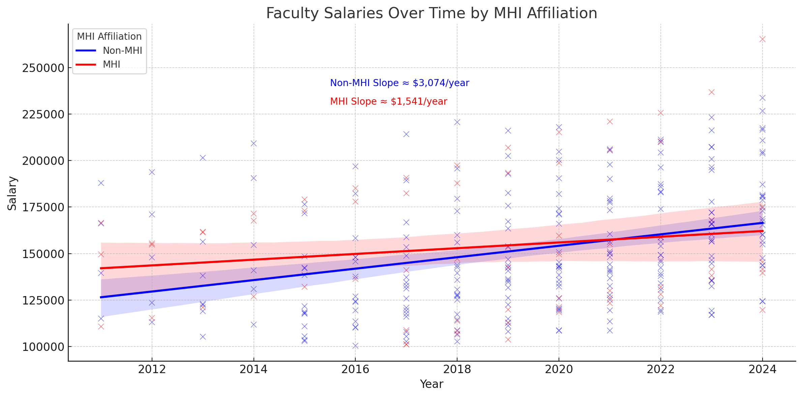

# Salary Discrepancies Between MHI- and Non-MHI-Affiliated Faculty Members in SPHS

**Author:** Jim Wallace  
**Date:** March 2024  

## Data Collection

To investigate potential salary discrepancies between faculty members affiliated with the Master of Health Informatics (MHI) program and those who are not (non-MHI) at the University of Waterloo, data was collected from the following sources:

- University of Waterloo public salary disclosures (2011–2024)  
- Faculty association publications outlining salary structures  
- School of Public Health Sciences faculty listings  

The data included annual salary figures and MHI affiliation status over a ten-year period to enable longitudinal analysis of salary progression.

## Analysis

Faculty members were categorized into two groups based on MHI affiliation. Average salary increases over the ten-year period were computed for each group. Since the dataset covers the full population of faculty in the department, formal statistical inference was not required. Descriptive comparisons and trend visualizations were used to illustrate observed differences.

## Results

The analysis reveals a notable disparity in salary progression:

- **Non-MHI faculty:** average annual salary increase of approximately \$3,074  
- **MHI-affiliated faculty:** average annual increase of around \$1,541  

Over ten years, this resulted in a cumulative difference of approximately \$15,330 in favor of non-MHI faculty. This pattern supports a hypothesis of systemic bias in performance evaluation, particularly given the interdisciplinary nature of the MHI program.

## References

- University of Waterloo salary disclosures (2011–2024)  
- FAUW salary structure publication  
- University of Waterloo SPHS MHI-affiliated faculty listings  
